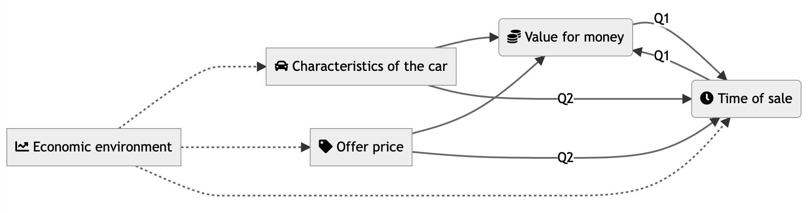
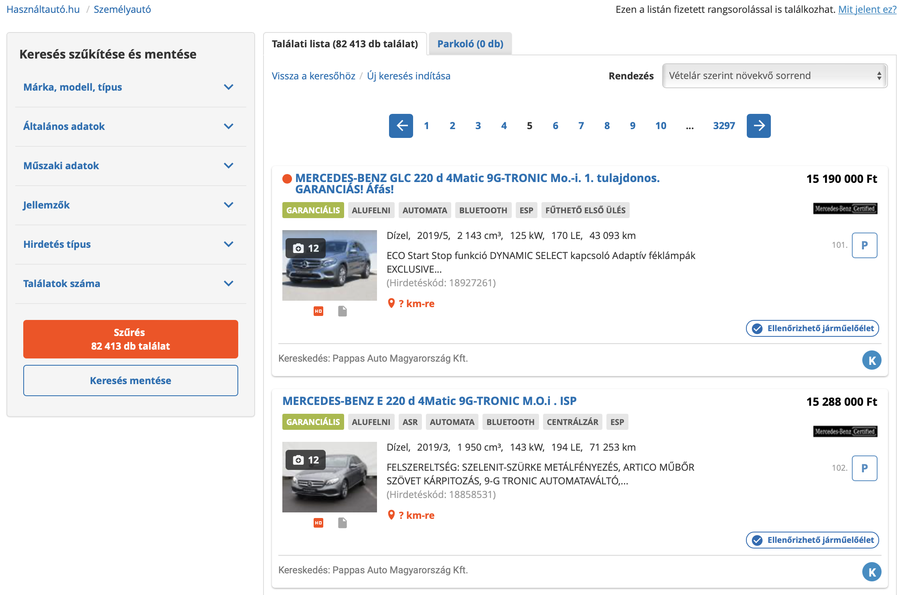
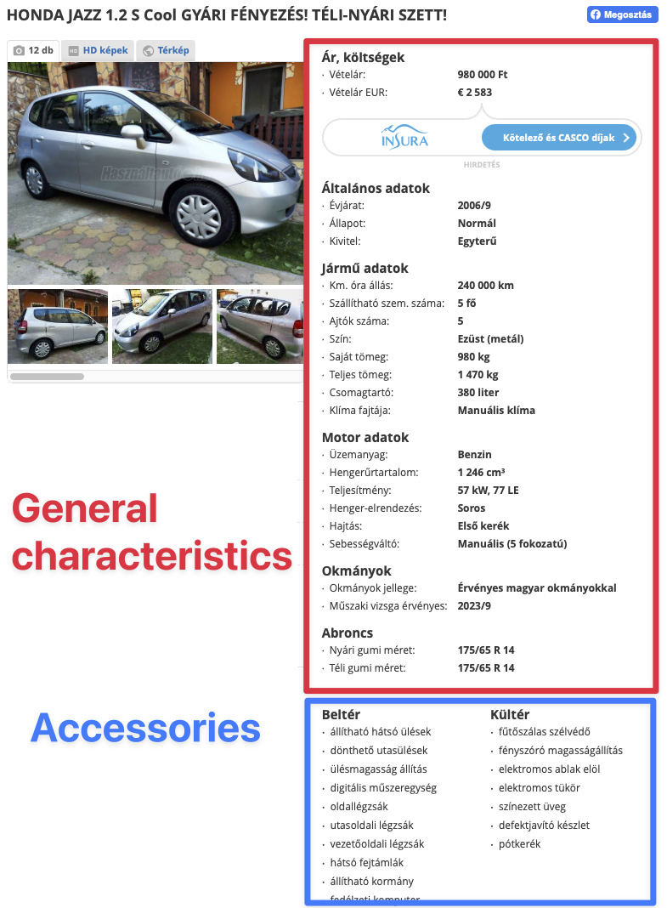
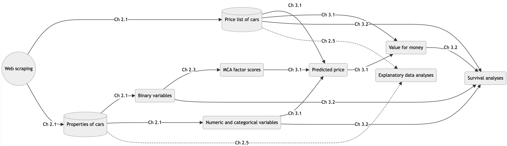
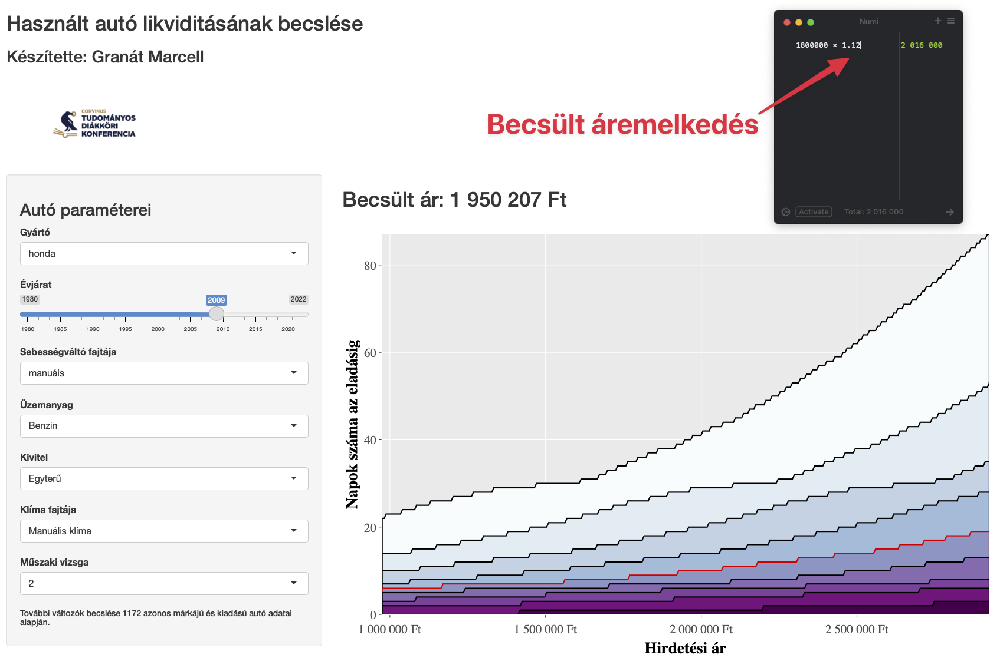

class: inverse, center, middle

# You don't dare to buy a car based on your models!

#### An unnamed fellow student

---

```{css, echo=FALSE}
.red { color: red; }
.blue { color: #378C95; }
strong { color: red; }
a { color: #378C95; font-weight: bold; }
.remark-inline-code { font-weight: 900; background-color: #a7d5e7; }
.caption { color: #378C95; font-style: italic; text-align: center; }

.content-box { 
box-sizing: content-box;
background-color: #378C95;
/* Total width: 160px + (2 * 20px) + (2 * 8px) = 216px
Total height: 80px + (2 * 20px) + (2 * 8px) = 136px
Content box width: 160px
Content box height: 80px */
}

.content-box-green {
background-color: #d9edc2;
}

.content-box-red {
background-color: #f9dbdb;
}

.fullprice {
text-decoration: line-through;
}
```

```{r xaringan-themer, include=FALSE, warning=FALSE}
library(xaringanthemer)
library(knitr)
library(granatlib)
library(emo)
library(magrittr)
library(tidyverse)
library(patchwork)
style_mono_accent(
  base_color = "#DC322F",               # bright red
  inverse_background_color = "#002B36", # dark dark blue
  inverse_header_color = "#378C95",     # light aqua green
  inverse_text_color = "#FFFFFF",       # white
  title_slide_background_color = "var(--base)",
  text_font_google = google_font("Kelly Slab"),
  header_font_google = google_font("Oleo Script")
)

xaringanExtra::use_panelset()
xaringanExtra::html_dependency_clipboard()
xaringanExtra::html_dependency_scribble(pen_color = "#378C95", 3, 4)
xaringanExtra::use_tile_view()

xaringanExtra::style_panelset_tabs(
  active_foreground = "#378C95"
)
```

```{r include=FALSE}
options(htmltools.dir.version = FALSE)
options(htmltools.dir.version = FALSE)
knitr::opts_chunk$set(echo = TRUE,
                      fig.align = "center", 
                      error = TRUE,
                      cache = TRUE,
                      message = F,
                      out.width = "700px",
                      fig.width = 7,
                      fig.height = 4.5, 
                      out.height = "450px",
                      dpi = 400,
                      warning = FALSE)
```

```{r results='hide', echo=FALSE}
library(tidyverse)

params <- list()
params$text_contained <- TRUE
knitr::knit_child('manuscript.rmd', quiet = TRUE)
```

## Motivation (as a journal paper)

- Car is one of the most expensive consumer durables on a household's bill

- Presumably the most important consideration is the price-to-value ratio

- Commonly sold on the used car market after use

--

- **How long it will take to sell?**

--

#### DAG

```{r out.height="180px", echo=FALSE}

```

---

## Source of data

- Daily scraped from the website [www.hasznaltauto.hu](https://www.hasznaltauto.hu)

- R codes are available: [https://marcellgranat.github.io/Data-Analysis/seminar5.html]()

- **All cars available** that day were collected, as well as all available information about
the vehicles

```{r echo=FALSE, out.height="500px"}

```

---

## Source of data

#### Daily scrape

- Platform dependent

- Windows: https://www.seancarney.ca/2020/10/11/scheduling-r-scripts-to-run-automatically-in-windows/

- Mac: Automator

---

## Source of data

#### Daily scrape

- Platform dependent

- Windows: https://www.seancarney.ca/2020/10/11/scheduling-r-scripts-to-run-automatically-in-windows/

- Mac: Automator

```{r echo=FALSE, out.height="270px", out.width="360px"}

```

---

## Source of data

#### Daily scrape

```{r echo=FALSE}
calendR::calendR(
  start_date = "2021-05-01",
  end_date =  "2022-02-28",
  special.col = "lightblue",
  special.days = download_days - as.Date("2021-04-30"),
  start = "M"
)
```

---

class: inverse, center, middle

# The data

---

## The data

## Detailed information about the cars

```{r}
cars_data
```

---

## The data

## Detailed information about the cars

.pull-left[

```{r echo=FALSE}

```

]

.pull-right[

**General characteristics**: available for all cars

**Accessories**: handled as binary (whether the car has or not)

]

---

## The Data

#### Prices

.pull-left[


```{r}
prices_df
```
]

--

.pull-right[

##### Assumptions

.content-box-red[
**1.** If a car is available on the website one day but not the next, it has been sold at the last listed price.
]

.content-box-red[
**2.** If a car is available on the website one day but not the next, it has been sold at the last listed price.
]

]

---

## The Data

#### Handling missing data

```{r cars_visdat, dev='png', echo=FALSE}
load("data/cars_data.RData")
names_to_select <- cars_data %>% 
  names %>% 
  NiceName() %>% 
  enframe() %>% 
  arrange(- str_length(value)) %>% 
  pull()

cars_data %>% 
  sample_n(10000) %>% 
  rename_all(NiceName) %>% 
  select(names_to_select) %>% 
  select(- Id) %>% 
  rename_all(str_to_sentence) %>% 
  rename_all(str_replace, " mot", " MOT") %>% 
  visdat::vis_miss() +
  theme(
    plot.margin = margin(1,1.3,1,1, "cm")
  )
```

---

## The Data

#### Handling missing data

- Size of the data is too large to use MICE

- Imputation based on **KNN** using only the presumably relevant variables

```{r eval=FALSE}
knn_impute <- function(.data, formula, ...) {
  outcome <- gsub("~.*", "", formula) %>% 
    str_trim()
  
  predictors <- gsub(".* ~", "", formula) %>% 
    str_split("\\+") %>% 
    reduce(c) %>% 
    str_trim()
  
  recipe(.data) %>% 
    step_normalize(all_numeric(), -outcome) %>% 
*   step_impute_knn(outcome, impute_with = predictors, ...) %>% 
    prep(retain = TRUE) %>% 
    juice() %>% 
    select(outcome)
}
```

---

## The Data

#### Handling missing data

.pull-left[
```{r echo=FALSE}
knitr::include_graphics("knn_wiki.svg")
```
]

.pull-right[
> Example of k-NN classification. The test sample (green dot) should be classified either to blue squares or to red triangles. If k = 3 (solid line circle) it is assigned to the red triangles because there are 2 triangles and only 1 square inside the inner circle. If k = 5 (dashed line circle) it is assigned to the blue squares (3 squares vs. 2 triangles inside the outer circle).

Source: [Wikipedia](https://en.wikipedia.org/wiki/K-nearest_neighbors_algorithm)
]

---

## The data

#### Handling missing data

```{r echo=FALSE}
c("nyari_gumi_meret ~ brand + evjarat + sajat_tomeg",
  "nyari_gumi_meret2 ~ brand + evjarat + sajat_tomeg",
  "nyari_gumi_meret3 ~ brand + evjarat + sajat_tomeg",
  "szallithato_szem_szama ~ brand + evjarat + sajat_tomeg",
  "ajtok_szama ~ brand + evjarat + sajat_tomeg + szallithato_szem_szama",
  "hengerurtartalom ~ brand + evjarat + szallithato_szem_szama",
  "henger_elrendezes ~ brand + evjarat + hengerurtartalom + teljesitmeny",
  "hajtas ~ brand + evjarat + teljesitmeny + uzemanyag",
  "sajat_tomeg ~ brand + evjarat + teljesitmeny + szallithato_szem_szama + ajtok_szama",
  "teljes_tomeg ~ brand + evjarat + teljesitmeny + szallithato_szem_szama + ajtok_szama",
  "uzemanyag ~ brand + evjarat + teljesitmeny + hengerurtartalom",
  "csomagtarto ~ brand + evjarat + szallithato_szem_szama + sajat_tomeg + teljes_tomeg") %>% 
  enframe(name = NULL) %>% 
  separate(value, c("imputed", "predictors"), "~") %>% 
  mutate(predictors = map(predictors, ~ str_split(., "[+]")[[1]])) %>% 
  unnest() %>% 
  mutate_all(str_trim) %>% 
  mutate_all(NiceName) %>% 
  group_by(imputed) %>% 
  summarise(predictors = str_c(predictors, collapse = ", ")) %>% 
  set_names("Imputed variable", "Predictors") %>% 
  mutate_all(str_to_sentence) %>% 
  knitr::kable(align = c("l", "l"))
```

---

## The data

#### Cleaning

```{r eval=FALSE}
szin = case_when(
  str_detect(szin, "kék") ~ "kek", 
  str_detect(szin, "ibolya") ~ "kek", 
  str_detect(szin, "türkiz") ~ "kek", 
  str_detect(szin, "piros") ~ "piros", 
  str_detect(szin, "vörös") ~ "piros",
  str_detect(szin, "bordó") ~ "piros",
  str_detect(szin, "fekete") ~ "fekete",
  str_detect(szin, "szürke") ~ "szurke",
  str_detect(szin, "ezüst") ~ "szurke",
  str_detect(szin, "fehér") ~ "feher",
  str_detect(szin, "barna") ~ "barna",
  str_detect(szin, "homok") ~ "barna",
  str_detect(szin, "pezsgő") ~ "barna",
  str_detect(szin, "bézs") ~ "barna",
  str_detect(szin, "vaj") ~ "barna",
  str_detect(szin, "zöld") ~ "zold",
  str_detect(szin, "sárga") ~ "sarga",
  str_detect(szin, "narancs") ~ "sarga",
  str_detect(szin, "lila") ~ "lila",
*     TRUE ~ "other"),
```

---

## The data

#### Cleaning

```{r eval=FALSE}
filter(!is.na(kilometerora_allasa) & !is.na(evjarat)) %>% 
  # evjarat ~ 1000 cars
  filter(kilometerora_allasa > 0)
```

---

## The data

#### Cleaning

```{r eval=FALSE}
price_change_df <- prices_df %>% 
  group_by(id) %>% 
  summarise(
    min_price = min(price, na.rm = TRUE),
    max_price = max(price, na.rm = TRUE),
*   price_change = max_price / min_price
  )

combined_df %>% 
  anti_join(
    price_change_df %>% 
*     filter(price_change > 5) %>% 
      # unrealistic jump in price ~ 100 cars
      select(id)
  ) %>% 
* filter(price <= 3e7 & price >= 3e5 & !is.na(fct_1)) %>%  
  # unrealistic prices ~ 15 000 cars
  na.omit()
```

---

## The data

#### Dimension reduction

- Handling the "accesories" type data as binary resulted 235 dummy variables.

- Some of the models we applied in this study use one-hot coding (470 0/1 columns) `r emo::ji("scream")`


--

- Appropriate methodology for binary data: **MCA**

---

## The data

#### Dimension reduction

```{r eval=FALSE}
training_df <- factor_df %>% 
  group_by_at(setdiff(names(additional_factor_df), "id")) %>%
  sample_frac(., size=.05) %>%
  ungroup() %>%
  na.omit() %>% 
  select(where(~ n_distinct(.) > 1), -id) %>% 
  mutate_all(as.character) %>% 
  mutate_all(as.factor)

n_factor <- training_df %>% 
  FactoMineR::MCA(graph = FALSE) %>% 
  # can calculate n_factor only from {FactoMineR}
  factoextra::get_eigenvalue() %>% 
  data.frame() %>% 
* filter(eigenvalue > mean(eigenvalue)) %>% 
  nrow()

fit_mca <- training_df %>% 
* MASS::mca(nf = n_factor) # can predict only w {MASS}
```

---

## The data

#### Dimension reduction

```{r eval=FALSE}
mca_factor_df <- factor_df %>% 
  select(names(training_df)) %>% 
  mutate_all(as.character) %>% 
  mutate_all(as.factor) %>% 
  group_by(cut(row_number(), 100)) %>% 
  # split the df to 100 pieces to avoid memory overload
  group_map(~.) %>% 
* map(~ data.frame(predict(object = fit_mca, newdata = .)))
```

--

The outcome: **236** numeric variables

---

class: middle, center

### The mainsteps of the study



---

## Determining the market price

--

- Value of each vehicle is different

--

- Focus of this study is not exploring the causal effects that influence the sale price, but the **accuracy** of the estimate

--

- Testing several ML methods in a **stratified k-fold cross-validation** (9,000/1,000; before July) framework

--

- Comparing models with the best hyperparamter set on a testing set (10,000; before July)

```{r echo=FALSE}
training_df <- df %>% 
  filter(date < "2021-07-01")
```

```{r eval=FALSE}
training_df %>% 
  sample_n(1e4) %>% 
  vfold_cv(strata = price, v = 10)
```

---

## Determining the market price

#### Descriptive statistics of offer prices in HUF

```{r echo=FALSE}
df %>% 
  mutate(
    qb = lubridate::floor_date(date, "quarter"),
    qe = lubridate::ceiling_date(date, "quarter"),
    qb = gsub("-01$", "", qb),
    qe = gsub("-01$", "", qe),
    qb = str_replace(qb, "-", "/"),
    qe = str_replace(qe, "-", "/"),
    Quarter = str_c(qb, "-", qe),
  ) %>% 
  group_by(Quarter) %>% 
  tot_summarise(total_name = "Total",
                Mean = mean(price),
                Median = median(price),
                `Standard deviation` = sd(price),
                Skeness = moments::skewness(price),
                Kurtosis = moments::kurtosis(price),
  ) %>% 
  arrange(as.character(Quarter)) %>% 
  mutate_at(2:4, format, big.mark = ",") %>% 
  knitr::kable(align = c("l", "c", "c", "c", "c", "c", "c"))
```

*Only the cars used in the modeling were taken into account in the calculation, excluding outliers.*

---

## Determining the market price


```{r echo=FALSE, out.height="300px", out.width="300px"}
knitr::include_graphics("recipes.png")
```

```{r eval=FALSE}
recipe(price ~ ., data = training_df) %>% 
* step_log(all_outcomes()) %>% 
  step_rm(id, date) %>% 
* step_normalize(all_numeric())
```

---

## Determining the market price

#### Number of hyperparameters, combination of tested parameters, and total runtime of hyperparameter tuning

```{r echo=FALSE}
base_tune %>% 
  unnest() %>% 
  select(model, .metrics) %>% 
  distinct(model, .keep_all = TRUE) %>% 
  mutate(
    `# of hyperparameters` = map_dbl(.metrics, ~ ncol(.) - 4),
    `# of parameter combinations` = map_dbl(.metrics, ~ nrow(.) / 2),
  ) %>% 
  left_join(runtime_df) %>%
  select(- .metrics) %>% 
  mutate(
    model = NiceNameModel(model),
    runtime = format(runtime, big.mark = ",")
  ) %>% 
  rename(Model = 1, `Runtime (seconds)` = runtime) %>% 
  knitr::kable(align = c("l", "c", "c", "c"))
```

---

## Determining the market price

#### Stratified k-fold cross-validation R-squared by **OLS**

```{r echo=FALSE}
base_tune$tune[[2]] %>% 
  unnest(.metrics) %>% 
  filter(.metric == "rsq") %>% 
  select(fold = id, rsq = .estimate) %>% 
  knitr::kable(align = c("c", "c"))
```

---

## Determining the market price

```{r echo=FALSE}
autoplot(base_tune$tune[[1]], metric = "rsq") + 
  ggtitle(NiceNameModel(base_tune$model[[1]])) + 
  theme_bw() +
  theme(
    plot.title = element_text(hjust = .5, size = 20, face = "bold")
  )
```

---

## Determining the market price

```{r echo=FALSE}
autoplot(base_tune$tune[[3]], metric = "rsq") + 
  ggtitle(NiceNameModel(base_tune$model[[3]])) + 
  theme_bw() +
  theme(
    plot.title = element_text(hjust = .5, size = 20, face = "bold")
  )
```

---

## Determining the market price

```{r echo=FALSE}
autoplot(base_tune$tune[[4]], metric = "rsq") + 
  ggtitle(NiceNameModel(base_tune$model[[4]])) + 
  theme_bw() +
  theme(
    plot.title = element_text(hjust = .5, size = 20, face = "bold")
  )
```

---

## Determining the market price

```{r echo=FALSE}
autoplot(base_tune$tune[[5]], metric = "rsq") + 
  ggtitle(NiceNameModel(base_tune$model[[5]])) + 
  theme_bw() +
  theme(
    plot.title = element_text(hjust = .5, size = 20, face = "bold")
  )
```

---

## Determining the market price

```{r echo=FALSE}
autoplot(base_tune$tune[[6]], metric = "rsq") + 
  ggtitle(NiceNameModel(base_tune$model[[6]])) + 
  theme_bw() +
  theme(
    plot.title = element_text(hjust = .5, size = 20, face = "bold")
  )
```

---

## Determining the market price

```{r echo=FALSE}
autoplot(base_tune$tune[[7]], metric = "rsq") + 
  ggtitle(NiceNameModel(base_tune$model[[7]])) + 
  theme_bw() +
  theme(
    plot.title = element_text(hjust = .5, size = 20, face = "bold")
  )
```

---

## Determining the market price

#### Comparing the estimation accuracy of the investigated models

```{r echo=FALSE}
bind_rows(testing_tune, validation_tune) %>% 
  pivot_wider(names_from = indicator) %>% 
  mutate(
    model = NiceNameModel(model),
    mean_validation = ifelse(set == "validation", mean, 0),
    model = fct_reorder(model, mean_validation),
    set = str_to_sentence(set)
  ) %>% 
  mutate(set = ifelse(set == "Testing", "Validation", "Testing")) %>% 
  ggplot(aes(y = model, group = set, color = set)) + 
  geom_errorbar(aes(xmin = ca, xmax = cf), position = position_dodge(width = .5)) + 
  geom_point(aes(x = mean), position= position_dodge(width = .5)) + 
  scale_x_continuous(labels = ~scales::percent(., 1)) + 
  labs(x = "R-squared", y = "Model", color = "CV sets") + 
  theme_bw() + 
  theme(legend.position = "bottom")
```

---

## Determining the market price

#### Descriptive statistics of the estimated price-to-value

```{r echo=FALSE}
surv_raw_df %>% 
  mutate(
    qb = lubridate::floor_date(date_end, "quarter"),
    qe = lubridate::ceiling_date(date_end, "quarter"),
    qb = gsub("-01$", "", qb),
    qe = gsub("-01$", "", qe),
    qb = str_replace(qb, "-", "/"),
    qe = str_replace(qe, "-", "/"),
    Quarter = str_c(qb, "-", qe),
  ) %>% 
  drop_na(price_diff) %>% 
  group_by(Quarter) %>% 
  tot_summarise(total_name = "Total",
                `Min (%)` = min(price_diff),
                `Lower quartile (%)` = quantile(price_diff, .25),
                `Median (%)` = quantile(price_diff, .5),
                `Higher quartile (%)` = quantile(price_diff, .75),
                `Max (%)` = max(price_diff),
                `Standard deviation (%p)` = scales::percent(sd(price_diff), accuracy = .01)
  ) %>% 
  mutate_at(2:6, ~ scales::percent(. - 1, .01)) %>% 
  arrange(desc(Quarter)) %>% 
  knitr::kable(align = c("l", "c", "c", "c", "c", "c", "c"))
```

*Price-to-value is defined as the proportion of offer price and the predicted price from XGBoost. To report in this table we subtracted 1 from the values.*

---

class: inverse, middle, center

# Survival Analysis

---

## Survival Analysis

#### Survival curve showing the probability of not having disappeared from the supply

```{r echo=FALSE}
km_df <- duration_df %>% 
  mutate(
    qb = lubridate::floor_date(date_start, "quarter"),
    qb = gsub("-01$", "", qb),
    qe = lubridate::ceiling_date(date_start, "quarter"),
    qe = gsub("-01$", "", qe),
    q = str_c(qb, " - ", qe),
    sold = date_end < "2022-03-01"
  )

km_all <- survfit(formula = Surv(duration, sold) ~ 1, data = km_df)

ggsurvplot(
  km_all, 
  risk.table = FALSE,
  conf.int = TRUE,      
  xlim = c(0,250),     
  legend = "none",
  xlab = "Time since the given car ad first appeared (days)",
  surv.scale = "percent",
  risk.table.title = "Number of unsold cars",
  break.time.by = 30, 
  ggtheme = theme_bw()
)
```

---

## Survival Analysis

Survival function:
$$G(t) = P(T \ge t)$$
The hazard rate (h) (intensity process:
$$h(t)=\lim _{\Delta \searrow 0} \frac{\mathbb{P}(T<t+\Delta \mid T \geq t)}{\Delta}=\frac{f(t)}{G(t)}$$
Proportional effect on the intensity process:
$$h_{i}(t)=c_{i} h_{0}(t),$$
Regression:

$$\ln c_{i}=\sum_{j=1}^{p} \beta_{j} x_{i j},$$

where $i$ refers to individual cars and $j$ refers to explanatory variables.

---

## Survival analysis

- Fitting a model with 250 explanatory variables would be inappropriate for interpretation

--

$$\text{LASSO}=\text{GLM} + \lambda \sum_{j=1}^p{|\beta_j|}$$

--

- The lambda that leads to the model having the lowest number of explanatory variables with **adequate accuracy** (within 1 standard error of the best model) is used for feature selection

--

    - **Harell C index**: proportion of concordant pairs in the total concordant and discordant (when the car estimated with the higher intensity is sold later) pairs

---

## Survival analysis

- Fitting a model with 250 explanatory variables would be inappropriate for interpretation

$$\text{LASSO}=\text{GLM} + \lambda \sum_{j=1}^p{|\beta_j|}$$


- The lambda that leads to the model having the lowest number of explanatory variables with **adequate accuracy** (within 1 standard error of the best model) is used for feature selection

    - **Harell C index**: proportion of concordant pairs in the total concordant and discordant (when the car estimated with the higher intensity is sold later) pairs
   

- LASSO-based model introduces bias by shrinking the coefficients of all variables towards zero, and does not provide information on the significance of the variable

--

    - Thus an unregularized with the selected variables is used for interpretation

---

## Survival analysis

#### K-fold cross-validation for finding the optimal lambda hyperparameter

```{r echo=FALSE}
plot(cvfit)
```

---

## Survival analysis

#### Estimated coefficients of the Cox models

```{r echo=FALSE}
full_join(tidy(fit_cox, conf.int = T), tidy(fit_cox_r, conf.int = T), by = "term") %>% 
  filter(!is.na(estimate.x) & !is.na(estimate.y)) %>% 
  pivot_longer(-term) %>% 
  mutate(
    model = ifelse(str_detect(name, ".x"), "All observations", "Inter-ventile"),
    name = str_remove(name, ".x|.y"),
    term = NiceName(term)
  ) %>% 
  pivot_wider() %>% 
  mutate(g = row_number() / n() > .5) %>% 
  ggplot(aes(y = term, color = model)) +
  geom_vline(xintercept = 0) +
  geom_point(aes(x = estimate), position = position_dodge(width = .5), alpha = .8) +
  geom_errorbar(aes(xmin = conf.low, xmax = conf.high), position = position_dodge(width = .5), alpha = .8) +
  theme_bw() +
  theme(
    strip.text = element_blank(),
    legend.position = "bottom",
    axis.text.x = element_text(angle = 90)
  ) +
  labs(
    color = NULL, x = "Estimated coefficient", y = "Term"
  ) +
  coord_flip()
```

---

## Survival analysis

#### Estimated coefficients of the Cox models

```{r echo=FALSE}
full_join(tidy(fit_cox, conf.int = T), tidy(fit_cox_r, conf.int = T), by = "term") %>% 
  filter(!is.na(estimate.x) & !is.na(estimate.y)) %>% 
  pivot_longer(-term) %>% 
  mutate(
    model = ifelse(str_detect(name, ".x"), "All observations", "Inter-ventile"),
    name = str_remove(name, ".x|.y"),
    term = NiceName(term)
  ) %>% 
  filter(term %in% c(
    "Value for money",
    "Tilting lamp",
    "Keyless entry",
    "Exhibited car",
    "Amplifier output",
    "American model"
  )) %>% 
  pivot_wider() %>% 
  mutate(g = row_number() / n() > .5) %>% 
  ggplot(aes(y = term, color = model)) +
  geom_vline(xintercept = 0) +
  geom_point(aes(x = estimate), position = position_dodge(width = .5), alpha = .8) +
  geom_errorbar(aes(xmin = conf.low, xmax = conf.high), position = position_dodge(width = .5), alpha = .8) +
  theme_bw() +
  theme(
    strip.text = element_blank(),
    legend.position = "bottom",
    axis.text.x = element_text(angle = 90)
  ) +
  labs(
    color = NULL, x = "Estimated coefficient", y = "Term"
  )
```

---

## Survival analysis

#### Survival model's response to the change of price-to-value

```{r echo=FALSE, out.height="350px", fig.height=3.5}
cox_design_df %>% 
  partial_effect_data("price_diff", integer = FALSE, cut_quantile = c(0, 1), n = 100) %>% 
  predict_quantile_prob(.fit = fit_cox, seq(from = .1, to = .9, by = .1)) %>% 
  pivot_longer(- 1) %>% 
  mutate(
    name = str_remove(name, "time_"),
    name = as.numeric(name),
    l = ifelse(name == min(name), str_c("Probablity of selling=", scales::percent(1 - name, 1)), scales::percent(1 - name, 1)),
    l = fct_reorder(l, name)
  ) %>% 
  ggplot() +
  aes(price_diff, value, label = l, group = name, fill = l) +
  geom_area(position = position_dodge(), show.legend = FALSE) +
  geomtextpath::geom_textline(aes(color = name == .5, linewidth = name ==.5), show.legend = FALSE) +
  scale_fill_brewer(palette = 3) +
  scale_x_continuous(expand = c(0, 0), labels = scales::percent) +
  scale_y_continuous(expand = c(0, 0)) +
  labs(x = "Offer price / Predicted price", y = "Days to sell") +
  scale_color_manual(values = c("black", "red2"))
```

*To capture the partial effect of price-to-value assuming that all other variables are unchanged, numeric predictors are fixed at their medians, while categorical and logical variables are fixed at their modes. The monotone increasing red line means that if the price-to-value is lower (the ratio of the offer price to the predicted price is higher), then the median selling time is higher.*

---

## Survival analysis

#### Example with a valid car



---

class: center, middle

# Thank you for your attention!

Slides are available at [www.marcellgranat.com](https://www.marcellgranat.com)

---

# References

```{r, print_refs, results='asis', echo=FALSE, warning=FALSE, message=FALSE}
library(RefManageR)
bib <- ReadBib("./reference.bib", check = FALSE)

ref_page <- 2
for (bib_item in seq_along(bib)) {
  
  if (bib_item %% 5 == 0) {
    cat("\n")
    cat("---")
    cat("\n")
    cat("# References ", ref_page)
    ref_page <- ref_page + 1
    cat("\n")
  }

print(bib[bib_item], 
  .opts = list(check.entries = FALSE, 
               style = "html", 
               bib.style = "authoryear"))
}
```
